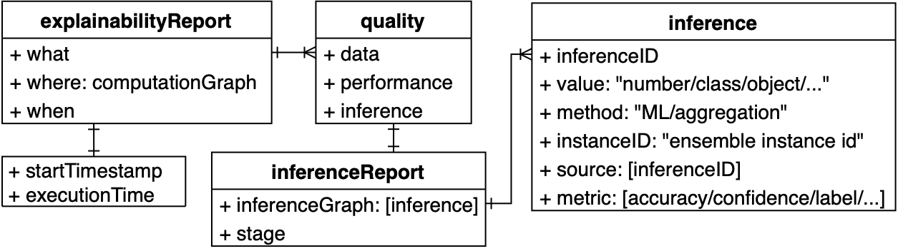

# QoA4ML - Quality of Analytics for Machine Learning Services

---

[](https://rdsea.github.io/QoA4ML/)


[](https://github.com/astral-sh/ruff)
[](https://git-scm.com/book/en/v2/GitHub-Contributing-to-a-Project)
[](https://github.com/rdsea/QoA4ML/actions/workflows/python-ci.yml)
[](https://opensource.org/licenses/Apache-2.0)

# Introduction

QoA4ML consists of a set of utilities and specs for supporting quality of analytics in ML services. Especially, we focus on ML services across edge-cloud continuum, which are built as a composition of services.

## QoA4ML Specification

The design of QoA4ML specification is in [language](language/)

## QoA4ML Utilities

Developers can call many functions from a QoAClient and QoA4ML's [utilities](qoa4ml_lib/utils.py) to evaluate/report ML-specific attributes (e.g., data quality, inference performance), build the quality reports, and send them to the observation services.
The QoAClient can be initiated with various configurations for specifying observation server and communication protocols (e.g., messaging) in different formats (e.g., json and yaml).

The detail documents for QoA4ML utilization is presented in [qoa4ml_lib](qoa4ml_lib/)

> For a local build and use QoA4ML one can do:

```bash
$python3 -m pip install build
$cd qoa4ml_lib/
$python -m build
```

## QoA4ML Reports

QoA Reports are implemented in [QoA4ML Utilities](qoa4ml_lib/qoa4ml/), an object supports developers in reporting metrics, computation graphs, and inference graphs of ML services in a concrete format.


## Examples

Examples are in [examples](example/).

## QoA4ML Observability

The code is in [observability](observability/)


QoA4ML Monitor is a component monitoring QoA for a ML model which is deployed in a serving platform.

- Monitoring Service: third party monitoring service used for managing monitoring data.
  - We use Prometheus and other services: provide information on how to configure them.
- QoA4MLObservabilityService: a service reads QoA4ML specifications and real time monitoring data and detect if any violation occurs

### Implementation using OPA

[OPA engine](https://www.openpolicyagent.org/docs/latest/#running-opa) is used to implement the service for checking violation under [qoa4mlopa](observability/qoa4mlopa/)

### ROHE Implementation

Another new engine is currently developed under [rohe_ObService](observability/rohe_ObService/)

## References

- Hong-Linh Truong, Minh-Tri Nguyen, ["QoA4ML -A Framework for Supporting Contracts in Machine Learning Services"](https://research.aalto.fi/files/65786264/main.pdf), [The 2021 IEEE International Conference on Web Services (ICWS 2021)](https://conferences.computer.org/icws/2021/), to appear.
- Minh-Tri Nguyen, Hong-Linh Truong [Demonstration Paper: Monitoring Machine Learning Contracts with QoA4ML](https://research.aalto.fi/files/56621517/main.pdf), Companion of the 2021 ACM/SPEC International Conference on Performance Engineering (ICPE'21), Apr. 19-23, 2021
- https://www.researchgate.net/publication/341762862_R3E_-An_Approach_to_Robustness_Reliability_Resilience_and_Elasticity_Engineering_for_End-to-End_Machine_Learning_Systems
