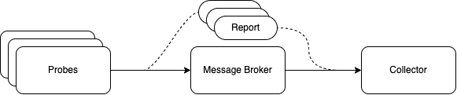

# QoA4ML - Quality of Analytics for ML

## Source code
https://github.com/rdsea/QoA4ML


## Monitoring Client
[QoA Client](qoa4ml/): an object that observes metrics, generates metric reports, and sends them to the Observation service via a list of connectors (e.g., messaging connector: RabbitMQ).

The developers only need to init a QoAClient at the beginning and use it to observe/evaluate metrics by self-instrumentation (calling its functions) at the right place in the source code.

- To initiate a QoA Client, developers can specify a configuration file path or refer to a configuration as a dictionary, or give the registration service (URL) where the client can get its configuration.

The `configuration` contains the information about the client and its configuration in form of dictionary

Example: 
```python
clientConf = { 
    "client":{
        "client_id": "aaltosea1",
        "instance_name": "ML02",
        "stage_id": "ML",
        "method": "REST",
        "application": "test",
        "role": "ml"
    },
    "connector":{
        "amqp_connector":{
            "class": "amqp",
            "conf":{
                "end_point": "localhost",
                "exchange_name": "qoa4ml",
                "exchange_type": "topic",
                "out_routing_key": "qoa.report.ml"
            }
        }
    }
}
qoaClient = QoaClient(config_dict=clientConf)
```
The `connector` is the dictionary containing multiple connector configuration (amqp, mqtt, kafka)
If 'connector' is not define, developer must give 'registration_url'
The 'registration_url' specify the service where the client register for monitoring service. If it's set, the client register with the service and receive connector configuration.
For example: "http://localhost:5001/registration"

- Via this client, developers can call different monitoring probes to measure desired metrics and categorize them into data quality, service performance or inference quality.
    - By using our probes (e.g., `observeErronous`, `observeMissing`, and `observeInferenceMetric`), the metrics are already categorized in the quality report.
    - For unsupported metrics or user-defined metrics, the developers can report them by using `observeMetric` providing metric's names and their expected categories. For example `qoaClient.observeMetric(metric_name="image_width", value=200, category=1)`.

- Category: metrics are categorized into following groups:
    - 0 - Quality: Performance (metrics for evaluating service performance e.g., response time, throughput)
    - 1 - Quality: Data (metrics for evaluating data quality e.g., missing, duplicate, erroneous)
    - 2 - Quality: Inference (metrics for evaluating quality of ML inference, measured from inferences e.g., accuracy, confidence)
    - 3 - Resource: metrics for evaluating resource utilization e.g. CPU, Memory
- To send the quality report to the observation service, the developers can call `report` from the QoAClient. For example: `qualityReport = qoaClient.report()`, the function will additionally return the `report` at current stage and save it to `qualityReport`
- To aggregate reports from previous stage (in a pipeline) for building the computation graphs, the client can call `importPReport`. For example `qoaClient.importPReport(previousReport)`


## Probes

* [QoA4ML Probes](qoa4ml/): libraries and lightweight modules capturing metrics. They are integrated into suitable ML serving frameworks and ML code
* Probe properties:
  - Can be written in different languages (Python, GoLang)
  - Can have different communications to monitoring systems (depending on probes and its ML support)
  - Capture metrics with a clear definition/scope
    - e.g., Response time for an ML stage (training) or a service call (of ML APIs)
    - Thus output of probes must be correlated to objects to be monitored and the tenant
  - Support high or low-level metrics/attributes
    - depending on probes implementation
  - Can be instrumented into source code or standlone

## Metric
We support some metric classes for collecting different types of metric: Counter, Gauge, Summary, Histogram

- `Metric`: an original class providing some common functions on an metric object.
    - Attribute:
        - `metric_name`
        - `description`
        - `value`
    - Function:
        - `__init__`: let user define the metric name, description and default value.
        - `set`: set its `value` to a specific value
        - `get_val`: get current value
        - `get_name`: return metric name 
        - `get_des`: return metric description 
        - `__str__`: return information about the metric in form of string
        - `to_dict`: return information about the metric in form of dictionary
- `Counter`
    - Attribute: same as `Metric` & on further developing
    - Function:
        - `inc`: increase the value of the metric by the given number/by 1 by default.
        - `reset`: set the value back to zero.
- `Gauge`
    - Attribute: same as `Metric` & on further developing
    - Function:
        - `inc`: increase the value of the metric by a given number/by 1 by default.
        - `dec`: decrease the value of the metric by a given number/by 1 by default.
        - `set`: set the value to a given number.
- `Summary`
    - Attribute: same as `Metric` & on further developing
    - Function:
        - `inc`: increase the value of the metric by a given number/by 1 by default.
        - `dec`: decrease the value of the metric by a given number/by 1 by default.
        - `set`: set the value to a given number.
- `Histogram`
    - Attribute: same as `Metric` & on further developing
    - Function:
        - `inc`: increase the value of the metric by a given number/by 1 by default.
        - `dec`: decrease the value of the metric by a given number/by 1 by default.
        - `set`: set the value to a given number.

## [QoA4ML Reports](https://github.com/rdsea/QoA4ML/blob/main/qoa4ml_lib/qoa4ml/reports.py)

This module defines ``QoA_Report``, an object that provide functions to export monitored metric to the following schema:
```json
{
    "computationGraph":{
        "instances":{
            "@instance_id":{
                "instance_name": "@name_of_instance",
                "method": "@method/task/function",
                "previous_instance":["@list_of_previous_instance"]
            },
            ...
        },
        "last_instance": "@name_of_last_instance_in_the_graph"
    },
    "quality":{
        "data":{
            "@stage_id":{
                "@metric_name":{
                    "@instance_id": "@value"
                }
            }
        },
        "performance":{
            "@stage_id":{
                "@metric_name":{
                    "@instance_id": "@value"
                }
            }
        },
        "inference":{
            "@inference_id":{
                "value": "@value",
                "confident": "@confidence",
                "accuracy": "@accuracy",
                "instance_id": "@instance_id",
                "source": ["@list_of_inferences_to_infer_this_inference"]
            }
        }
    }
}
```

The example is shown in `example/reports/qoa_report/example.txt`

- Attribute:
    - `previous_report_instance` = list previous services
    - `report_list`: list of reports from previous services
    - `previous_inference`: list previous inferences
    - `quality_report`: report all quality (data, service, inference qualtiy) of the service
    - `execution_graph`: report the execution graph
    - `report`: the final report to be sent

- Function:
    - `__init__`: init as empty report.
    - `import_report_from_file`: init QoA Report from `json` file.
    - `importPReport`: import reports from previous service to build the execution and inference graph
    - `build_execution_graph`: build execution graph from list of previous reports
    - `build_quality_report`: build the quality report from metrics collected in runtime
    - `generateReport`: return the final report.
    - `observeMetric`: observe metrics in runtime with 3 categories: service quality, data quality, inference qualtiy. This can be extended to observe resource metrics.


## [Examples](https://github.com/rdsea/QoA4ML/tree/main/example)
https://github.com/rdsea/QoA4ML/tree/main/example


## Overview


Probes will be integrated to client program or system service to collect metrics at the edge
Probes will generate reports and sent to message broker using different connector. Coresponding collector should be used to acquire the metrics.

## Collector
The manager/orchestrator have to integrate collector to collect metric using different protocols for further analysis.
- Attribute:
- Function:
    - `__init__`: take a configuration as a `dict` containing information about the data source, eg. broker, channel, queue, etc. It can take an `object` as an attribute `host` to return the message for further processing.


    - If the collector is initiated by an object inherited class, this class must implement `message_processing` function to process the message returned by the collector. Otherwise, the collector will print the message to the console.

    - `on_request`: handle message from data source (message broker,...)

    - `start` & `stop`: start and stop consuming message

    - `get_queue`: return the queue name.

## Connector
Connectors are implement with different protocols for sending report. Example: sending report to message broker - AMQP/MQTT
- Attribute:
- Function:
    - `__init__`: take a configuration as a `dict` containing information about the data sink, eg. broker, channel, queue, etc. It can take a `bool` parameter `log` for logging messages for further processing.

    - `send_data`: a function to send data to specified `routing_key`/`queue` with a corresponding key `corr_id` to trace back message.


## Utilities
A module provide some frequently used functions and some function to directly collect system metrics.

## Note
- `eva_duplicate`, `eva_erronous`, `eva_missing`, and `detect_outlier` probes are using ydata-quality library, which is only available for Python 3.8
- For using ML quality probes, you may need to install a few more dependencies, e.g., tensorflow and Pillow.
- QoaClient uses AMQP protocol by default. To use MQTT, you may need to install `paho-mqtt`.
- To monitor Docker stats, you need to install [docker](https://docker-py.readthedocs.io/en/stable/) python client. 
- To connect with Prometheus, you need to install [prometheus-client](https://pypi.org/project/prometheus-client/)
